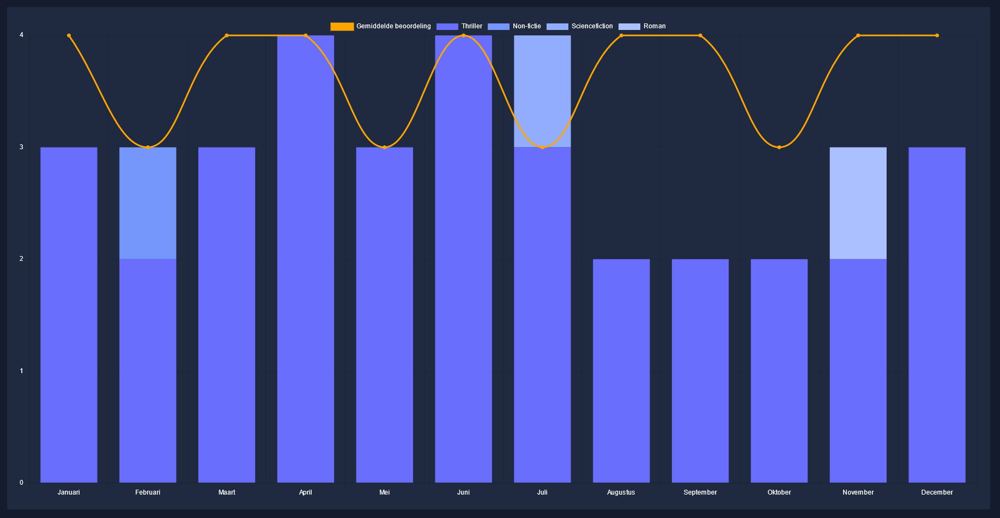

# NovelMetrix
NovelMetrix is a webapp where you can track your reading progress. Not only you can use it as a personal reading journal (managing your readed books and challenges) but it also contains an analytics dashboard to visually show your progress.

### Features
- Dashboard where you can visually check your progress
- Manage you readed books
- Manage your reading challenges

### Technical details
This Full Stack webapp is build with Django (Python) as a backend API and for the frontend UI I've integrated React (Javascript) into the Django app.

- Authentication with JSON Web Token (JWT)
- Pandas package for data analytics
- SQLAlchemy package for the database